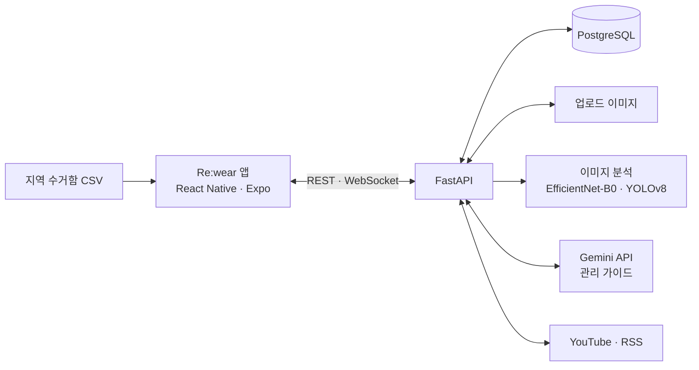

# Re:wear

### 내 옷을 이해하고, 오래 입고, 다시 순환시키다.

사진으로 찾는 관리법, 기록으로 채우는 옷장, 다시 입는 즐거움. 
**AI와 함께하는 슬로우패션 옷 관리 앱**

 

전공종합설계 PBL · **G팀 홍태호패션연구소**

[서비스 소개](#서비스-소개) · [주요 기능](#주요-기능) · [핵심 구현](#핵심-구현) · [기술 스택](#기술-스택) · [개발 가이드](docs/DEVELOPMENT.md) · [팀 소개](#팀-소개)

 

## 서비스 소개

**“이 옷, 어떻게 세탁하고 얼마나 더 입을 수 있을까?”**

Re:wear는 옷을 산 이후의 일상을 돕습니다. 어려운 세탁 기호와 소재별 관리법을 사진으로 알아보고, 가진 옷의 착용·세탁 이력을 기록합니다. 손이 가지 않는 옷은 리폼 아이디어, 커뮤니티, 헌옷수거함 지도를 통해 다음 쓰임을 찾아갑니다.

| 알아보기 | 오래 입기 | 다시 순환하기 |
| :---: | :---: | :---: |
| 케어라벨·소재 분석 | 나의 옷장·활동 기록 | 리폼·소통·수거함 지도 |
| **내 옷에 맞는 관리법을 찾고** | **필요할 때 관리하며** | **새로운 쓰임으로 연결합니다.** |

## 주요 기능

<table>
  <tr>
    <th width="33%" align="center">01. 오늘의 옷 관리</th>
    <th width="33%" align="center">02. 나의 옷장</th>
    <th width="33%" align="center">03. 리웨어 라운지</th>
  </tr>
  <tr>
    <td align="center"></td>
    <td align="center"></td>
    <td align="center"></td>
  </tr>
  <tr>
    <td align="center">세탁이 필요한 옷을 확인하고 관리법을 찾아보세요.</td>
    <td align="center">가진 옷을 등록하고 입고 세탁한 날을 기록하세요.</td>
    <td align="center">의류와 리폼 경험을 공유하고 채팅으로 대화를 이어가세요.</td>
  </tr>
</table>

중간 발표 자료 14·17·24쪽의 앱 화면입니다. 현재 개발 화면과 일부 차이가 있을 수 있습니다.

### 사진 한 장으로 시작하는 관리

- **케어라벨 촬영** — 세탁 기호를 인식하고 세탁·건조·다림질 방법을 안내합니다. 흐릿한 라벨은 기호를 직접 선택해 확인할 수 있습니다.
- **소재 분석** — 의류 사진에서 소재 후보를 확인하고, 소재별 기본 세탁법과 AI 관리 가이드를 받아봅니다.
- **옷장 등록** — 사진·이름·카테고리와 함께 의류 정보를 저장합니다. 사용자 정의 카테고리로 옷장을 정리할 수 있습니다.

### 기록할수록 쉬워지는 옷 관리

- **착용·세탁 캘린더** — 어떤 옷을 언제 입고 세탁했는지 날짜별로 기록합니다.
- **세탁 필요 알림·빨래통** — 마지막 세탁 이후의 착용 횟수와 소재·카테고리별 기준으로 세탁이 필요한 옷을 앱에서 확인하고 빨래통에 담습니다.
- **리웨어 빌리지** — 옷 등록, 착용·세탁 기록 등 일일 미션으로 포인트를 모아 동물과 오브젝트를 구매하고 나만의 숲을 꾸밉니다.

### 안 입는 옷의 다음 쓰임 찾기

| 기능 | 할 수 있는 일 |
| :--- | :--- |
| 리폼·업사이클링 | `셔츠`, `셔츠 치마` 등 키워드로 관련 YouTube 영상 검색 |
| 리웨어 라운지 | 여러 장의 사진이 담긴 게시글 작성, 좋아요·댓글, 1:1 채팅 |
| 헌옷수거함 지도 | 현재 위치를 기준으로 수거함 확인 — **서울 구로구·양천구 데이터 포함** |
| 지속가능 패션 콘텐츠 | 패션·환경 뉴스 탐색, 슬로우패션 브랜드 확인과 관심 브랜드 저장 |

## 핵심 구현

### 이미지 분석에서 관리 설명까지

이미지를 분석하는 모델과 관리법을 설명하는 생성형 AI를 연결합니다. **케어라벨은 기호와 위치를 감지하고, 의류 사진은 소재 후보를 분류하는 별도 흐름**으로 처리합니다.

| 입력 | 분석 과정 | 결과 |
| :--- | :--- | :--- |
| 케어라벨 사진 | YOLOv8 기호 감지 → Gemini 설명 생성 | 기호·위치·신뢰도와 단계별 세탁 가이드 |
| 의류 사진 | EfficientNet-B0 멀티라벨 분류 → 소재 후보 선택 → 관리 가이드 생성 | 소재 후보·확률과 의류별 관리 정보 |

소재 분류에는 **13개 클래스, 클래스별 임계값, 상위 5개 후보**를 사용합니다. 발표 자료 기준 케어라벨 학습 클래스는 21개이며, 소재 학습에는 AI Hub 의류 이미지 데이터를 활용했습니다. AI 분석 결과는 추정치이므로 의류에 부착된 실제 케어라벨을 함께 확인해야 합니다.

### 기능을 연결하는 구현

| 구현 포인트 | 적용 방식 | 관련 코드 |
| :--- | :--- | :--- |
| 이미지 감지와 설명 분리 | 케어라벨 감지 API와 설명 생성 API를 분리해 기호 결과를 관리 문장으로 연결 | [케어라벨 API](backend/app/routers/laundry.py) |
| 소재별 판정 기준 | 각 클래스의 확률과 임계값을 비교하고 상위 후보도 함께 반환 | [소재 추론](backend/app/services/material_infer.py) |
| 기록 기반 세탁 안내 | 마지막 세탁 이후의 착용 횟수를 소재·카테고리별 기준과 비교 | [세탁 알림 로직](backend/app/services/alert_service.py) |
| 실시간 대화 | 채팅방별 메시지 저장과 WebSocket 연결로 1:1 대화 지원 | [채팅 API](backend/app/routers/chat.py) |
| 반복 실천의 보상 | 일일 미션 수행, 포인트 적립, 아이템 구매를 빌리지와 연결 | [빌리지 API](backend/app/routers/game.py) |

모델 파일과 실제 추론 경로는 [AI 모델·API 안내](docs/DEVELOPMENT.md#ai-모델과-api)에서 확인할 수 있습니다.

## 기술 스택

| 영역 | 사용 기술 | 프로젝트에서의 역할 |
| :--- | :--- | :--- |
| 모바일 | React Native 0.81 · Expo SDK 54 · Expo Router | iOS·Android 앱과 파일 기반 화면 라우팅 |
| 앱 데이터·화면 | JavaScript · 일부 TypeScript · Axios · AsyncStorage · Maps · Calendars · Lottie | API 통신, 로그인 정보 저장, 지도·달력·빌리지 표현 |
| 서버 | FastAPI · SQLAlchemy · Alembic | 기능별 API, 데이터 접근, DB 마이그레이션 |
| 저장소 | PostgreSQL · 서버 업로드 디렉터리 | 사용자·의류·활동·커뮤니티 데이터와 이미지 저장 |
| AI | PyTorch · Torchvision · EfficientNet-B0 · Ultralytics YOLOv8 · Gemini API | 소재 분류, 세탁 기호 감지, 관리 설명 생성 |
| 외부 연동 | Kakao Login · JWT · WebSocket · YouTube Data API · RSS · APScheduler | 인증, 실시간 채팅, 리폼 영상, 뉴스 수집·갱신 |

<strong>시스템 구성 보기</strong>

이미지 추론은 서버에서 수행합니다. 뉴스는 서버 시작 시와 이후 6시간 간격으로 갱신하며, 수거함 지도는 앱에 포함된 지역별 CSV를 사용합니다.

## 개발 시작하기

앱과 FastAPI 서버를 각각 실행합니다. **현재 신규 환경 구동에는 누락된 Python 의존성과 DB 마이그레이션 보완이 필요합니다.** 환경 변수, 설치 절차와 확인된 보완 사항은 개발 가이드에 정리했습니다.

| 문서 | 내용 |
| :--- | :--- |
| [개발 환경 구성](docs/DEVELOPMENT.md) | 사전 준비 → 환경 변수 → 백엔드·모바일 실행 |
| [AI 모델과 API](docs/DEVELOPMENT.md#ai-모델과-api) | 모델 파일, 실제 추론 경로, 임시 응답 경로 구분 |
| [프로젝트 구조](docs/DEVELOPMENT.md#프로젝트-구조) | 앱 화면과 백엔드 디렉터리 안내 |

## 앞으로의 Re:wear

발표 자료에서 제안한 확장 방향입니다.

- **개인별 의류 관리 고도화** — 기록 기반 세탁 주기 추천과 의류 수명 예측
- **수선·리폼 서비스 연결** — 세탁소, 리폼 업체, 친환경 브랜드 연계
- **지역 의류 순환 확대** — 지자체 수거함 데이터와 배출·수거 정보 연계
- **지속가능 패션 교육** — 관리와 재활용을 직접 실천하는 교육 도구로 확장

## 팀 소개

**전공종합설계 PBL · G팀 홍태호패션연구소**

| [홍주성](https://github.com/juuu-sung) | 김재호 | 한태희 |
| :---: | :---: | :---: |
| 팀장 | 팀원 | 팀원 |

서비스 기획·팀 정보·화면: 「Rewear_G팀_홍태호 패션연구소」 중간 발표 자료. 기술 설명: 저장소의 구현 기준.
