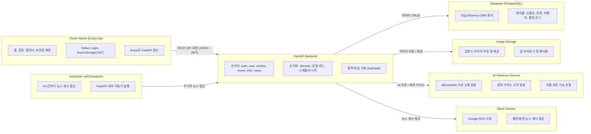

# 👕 ReWear  
### AI 기반 의류 관리 & 세탁 가이드 앱

> “당신의 옷장을 더 똑똑하게, 더 오래 지속 가능하게.”

---

## 🧩 프로젝트 개요

**ReWear**는 옷 사진 한 장으로  
AI가 **소재를 자동 판별(EfficientNet-B0)** 하고  
**세탁 라벨을 인식(YOLOv8)** 하여  
사용자에게 **맞춤형 세탁 가이드, 리사이클 뉴스, 브랜드 추천**을 제공합니다.  

또한, 캘린더로 착용/세탁 이력을 관리하고,  
의류의 수명 주기를 시각화하여 **지속 가능한 패션 소비**를 돕습니다.

---

## 🚀 주요 기능

| 카테고리 | 기능 | 설명 |
|-----------|------|------|
| 👕 **의류 AI 분석** | EfficientNet-B0 기반 **소재 분류** 및 YOLOv8 기반 **세탁 라벨 인식** |
| 🧺 **세탁 가이드 추천** | AI가 감지한 소재·라벨에 따라 **적정 세탁 온도 / 세제 / 다림질 방법 자동 안내** |
| 📅 **옷장 & 캘린더 관리** | 착용, 세탁, 기부, 리사이클 등 이벤트 기록 및 주기 관리 |
| ♻️ **Recycle 탭 (지도)** | Expo Location + Google Maps 기반 **의류 수거함 위치 표시 (CSV 연동)** |
| 📰 **리사이클 뉴스 피드** | AI가 큐레이션한 **지속가능 패션 / 친환경 브랜드 뉴스 제공** |
| 🏷️ **리사이클 브랜드 추천** | 사용자의 옷장 패턴에 맞춰 **리사이클/업사이클 브랜드 추천** |
| 🔐 **Kakao 로그인 & JWT 인증** | 간편 로그인 및 사용자별 옷장 데이터 관리 |

---

## 🧠 AI 모델 구조

| 모델 | 역할 | 프레임워크 |
|------|------|-------------|
| **YOLOv8** | 세탁 라벨 감지 | Ultralytics YOLO |
| **EfficientNet-B0** | 의류 소재 분류 | PyTorch |
| **LLaMA 기반 TTS** | 친절한 세탁 가이드 음성 안내 | Meta LLaMA + TTS pipeline |

**데이터셋:** AI-Hub 의류 이미지 + 세탁라벨 데이터  
**클래스 수:** 13종 (`cotton`, `polyester`, `wool`, `silk`, `nylon`, `linen`, `spandex`, `rayon`, …)

---

## 🧰 기술 스택

| 구분 | 사용 기술 |
|------|------------|
| **Frontend** | React Native (Expo), TypeScript, Axios, AsyncStorage, Kakao SDK |
| **Backend** | FastAPI, PostgreSQL, SQLAlchemy, Alembic, APScheduler |
| **AI/ML** | PyTorch, YOLOv8, EfficientNet-B0, LLaMA |
| **Infra** | Vultr VPS, Docker, Nginx, Uvicorn |
| **Etc** | REST API, .env 환경변수, GitHub Actions |

---

